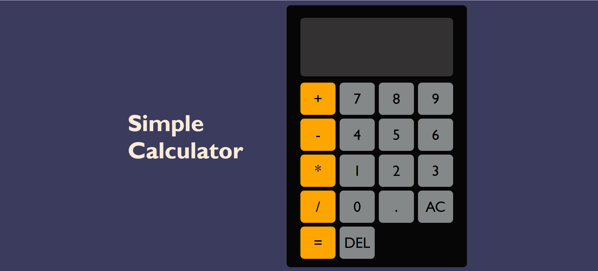

# 🔢 Simple Calculator

A basic calculator built using **HTML**, **CSS**, and **JavaScript**.  
It supports addition, subtraction, multiplication, and division.  
 

## 🚀 Features

- Clean UI using CSS
- Responsive button grid layout
- Basic math operations (+, –, ×, ÷)
- Clear button to reset input
- Equals button to calculate result

## 🛠 Technologies Used

- HTML
- CSS
- JavaScript

## 🖥️ Demo

